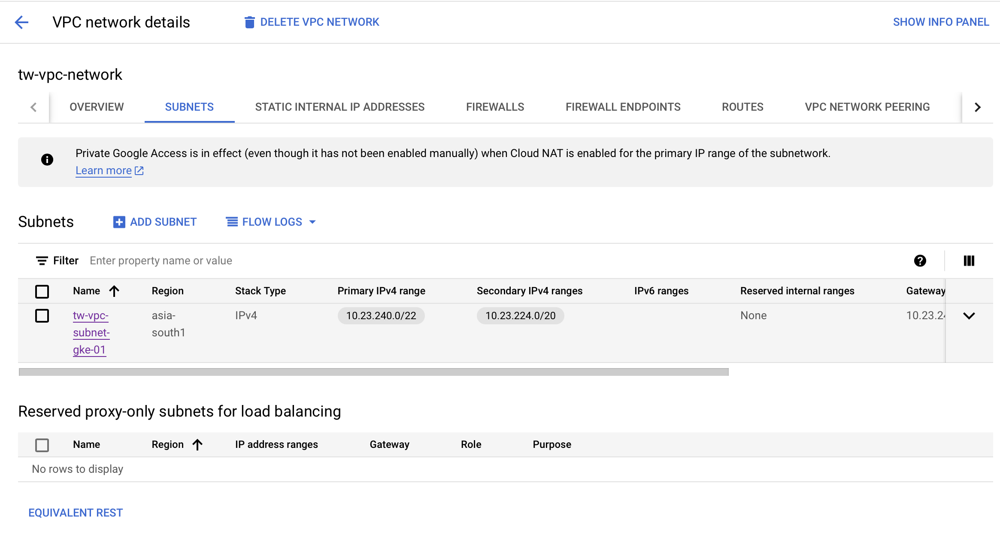

# The Deployment of the MediaWiki using Terraform and Helm

This repo consists of the modules which would be requrired for the deployment of the MediaWiki in the K8S environment in an automated way. The included modules are

<ul>
<li> Networking </li>
<li> Service Accounts </li>
<li> Kubernetes Cluster </li>
</ul>

## Execution Flow

<strong>The folder structure</strong>

`terraform.tfvars` : Each module consists of a `terraform.tfvars` file, this consists of the values which are required for the resource creation.
`provider.tf` : The details of the remote state and the terraform providers configuration is present in the `provider.tf` file.

`main.tf` : This consists of the desclaration of the module, i.e. the location from where the module is called, ideally the modules are present in another github repository which is utilised at multiple places but for demo purposes, I have kept it here along with the definition of the module in a folder.

<strong>The folder structure</strong>

- Open the terminal according to the sequence and run the commands for terraform formatting : `terraform fmt .`
- Initilise the terraform by command `terraform init`, as this will initilise the state of the terraform in remote storage.
- Plan the terraform resource creation `terraform plan`.
- After successful creation and analysis of the plan, `terraform apply` to give manual approval or `terraform approve --auto-approve` to approve this automatically in an automated flow.
- Verify the created resources.

## Demo and Screenshots

1. The execution of the Networking module 

2. The execution of the Service account module

3. The execution of the K8s Cluster

5. The workloads of the Mediawiki was getting connection refused, resolution of this required more time than I alloted for this task myself, skipped it because of limited bandwidth.
 

6. The Remote state files stored in the storage bucket in the GCP after successful creation of the resources
